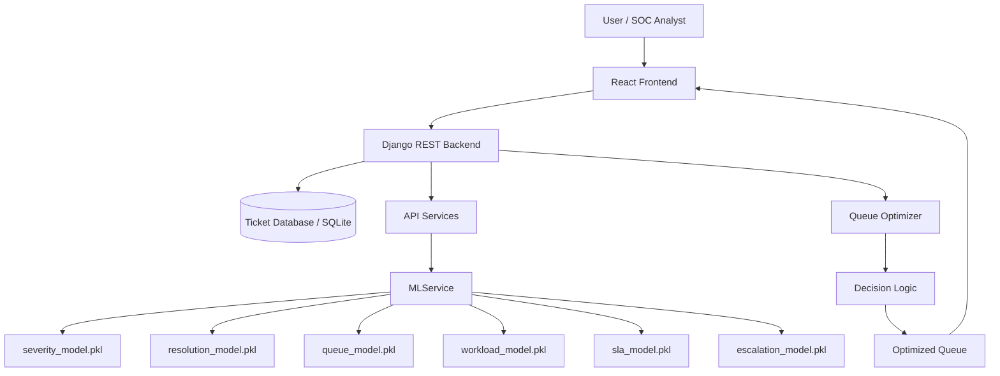

# SLAShield

Live Link : https://slashieldai.onrender.com/

Mock Data Link : https://drive.google.com/drive/folders/12stDQqdD79bSDcMHxrB_6_bLDlg96aAO?usp=drive_link

Note : Mock Data can be used to check the SLAShieldAI performance and feasibility.

## Security SLA Breach Prevention Agent

SLAShield is an AI-powered cybersecurity incident management system designed to forecast SLA breach risk before deadlines are missed and to recommend queue interventions that reduce expected customer-impacting failures. It is not a simple SLA countdown tool. The system evaluates ticket characteristics, queue pressure, analyst workload, historical patterns, predicted resolution time, predicted queue delay, and expected breach probability to decide whether a ticket should remain in the current queue, be prioritized, reassigned, or escalated.

The repository contains a Django backend, a React frontend, six trained scikit-learn models, and a deterministic queue optimization engine. The implementation focuses on real queue intelligence and forecast-based decision support using synthetic cybersecurity incident data rather than a timer-only dashboard.

---

## Hackathon Problem Statement

The official hackathon challenge asks for an AI system that predicts which security tickets are likely to breach SLA and recommends actions such as reassignment, escalation, or prioritization. The problem is operationally important because security incidents often arrive continuously, each with different severity, SLA requirements, historical context, queue conditions, and analyst capacity.

A ticket may be at risk even when a countdown still shows remaining time because queue delay can rise, analyst workload can spike, higher-priority incidents may arrive, and resolution time can exceed the expected forecast. This creates business risk for the SOC and for the organization because missed SLAs can translate into delayed containment, lost trust, increased operational cost, and higher exposure.

---

## Problem Overview

Security teams receive a continuous stream of incident tickets. The queue is not just a static list of tasks; it is a dynamic operating environment shaped by:

- varying security incident severity
- different resolution-time expectations
- different SLA constraints by severity
- analyst availability and skill differences
- queue congestion and delays
- changing operational pressure as new tickets arrive

The system goal is not to count down time, but to estimate future risk and to recommend the most effective intervention before the SLA is missed.

---

## Why SLA Breaches Matter

Security operations teams must minimize response and resolution delays, but a large queue can create a false sense of safety when quantities of tickets look manageable on paper. A ticket may appear to have remaining time while the queue and workload behind it continue to worsen.

SLAShield addresses this by forecasting likely breach risk from ticket attributes and queue state. It does not wait for the SLA to fail; it predicts future miss risk and recommends actions that reduce the expected incident backlog impact.

---

## Solution Overview

SLAShield follows a practical AI workflow:

Security Tickets
↓
Validation and Normalization
↓
Feature Preparation
↓
ML Inference
↓
Severity / Resolution / Queue Delay / Workload / SLA Risk / Escalation Priority
↓
Queue Analysis
↓
Intervention Simulation
↓
Queue Optimization
↓
Optimized Queue and Dashboard

The implementation is centered on the existing repository logic:

- Django REST API for ticket ingestion and dashboard data
- React UI for monitoring and queue actions
- six model artifacts in `backend/models/`
- deterministic queue optimization in `backend/queue_optimizer.py`
- decision persistence in the SQLite database

---

## Key Objectives

The project is aligned to the hackathon objective of operational incident management and breach prevention:

- predict which tickets are likely to miss SLA
- estimate queue delay and workload risk
- identify high-priority or high-risk tickets
- suggest interventions such as prioritization, reassignment, or escalation
- compare before/after queue outcomes
- show risk and queue impact on the dashboard

---

## Core Features

The repository contains the following implemented features:

- CSV/JSON ticket upload with backend validation and normalization
- active ticket tracking and status management
- analyst roster and utilization tracking
- default SLA rules by severity defined in `backend/api/services/sla_service.py`
- queue optimization engine using the existing model pipeline
- before/after queue comparison in the API and UI
- dashboard metrics for active tickets, risk, and historical optimization runs
- decision log storage and recent decision visibility
- synthetic training/demo workflow for model generation and queue testing

---

## AI/ML Architecture

The ML architecture in this project is a classic synthetic incident prediction pipeline.

1. Synthetic ticket records are generated in training scripts.
2. The feature set is prepared using the fixed base schema defined in `backend/queue_optimizer.py`.
3. Models are trained with scikit-learn random-forest learners.
4. Models are serialized to the `backend/models/` folder using `joblib`.
5. During inference, `MLService` loads the six models and runs predictions for each ticket.
6. `predict_ticket()` combines the model outputs into a per-ticket operational assessment.
7. The queue optimizer evaluates candidate interventions and chooses the best action.

---

## AI/ML Models

The actual project contains six model artifacts and corresponding runtime loading logic. The source of truth is in `backend/api/services/ml_service.py` and `backend/demo_queue.py`.

### 1. Incident Severity Classification

Problem Type: Classification

Algorithm: Random Forest Classifier

Inputs: `Incident_Type`, `Source`, `Attack_Vector`, `Priority`, `Affected_Systems`, `Users_Affected`, `Threat_Score`, `Analyst_Experience_Years`, `Current_Queue`, `Available_Analysts`, `SLA_Hours`, `Historical_Incidents`, `Time_of_Day`, `Day_of_Week`

Output: severity label such as Low, Medium, High, or Critical

Purpose: classify incoming incidents so that the queue and prioritization logic can react appropriately to severity.

### 2. Resolution Time Prediction

Problem Type: Regression

Algorithm: Random Forest Regressor

Inputs: same 14 base feature set

Output: predicted resolution time in hours

Purpose: estimate how long a ticket is likely to take to resolve; this contributes directly to SLA risk assessment.

### 3. SLA Breach Probability

Problem Type: Probabilistic classification

Algorithm: Random Forest Classifier using `predict_proba`

Inputs: the same model feature set plus the predicted resolution time and predicted queue delay derived during inference

Output: probability of breach in the range 0.0 to 1.0, converted to a percentage in the pipeline

Purpose: this is the core predictive signal for SLA miss risk. The model produces the probability used by the optimizer and displayed to users on the dashboard.

### 4. Analyst Workload Prediction

Problem Type: Regression

Algorithm: Random Forest Regressor

Inputs: the base feature set

Output: predicted future analyst workload

Purpose: estimate how busy an analyst or queue is likely to become, which supports reassignments and overload-aware decisions.

### 5. Queue Delay Prediction

Problem Type: Regression

Algorithm: Random Forest Regressor

Inputs: the base feature set

Output: predicted queue delay in minutes

Purpose: estimate delay accumulation due to queue conditions and backlog; this is then combined with predicted resolution time for breach assessment.

### 6. Escalation Priority

Problem Type: Classification

Algorithm: Random Forest Classifier

Inputs: the feature set plus predicted resolution, predicted queue delay, and SLA breach probability

Output: escalation priority such as P1, P2, P3, or P4

Purpose: determine whether an incident should be escalated or handled at a standard level.

---

## Model Chain / Dependencies

The implemented model chain is straightforward and deterministic:

Ticket
↓
Severity Model
↓
Resolution-Time Model
↓
Queue-Delay Model
↓
Analyst Workload Model
↓
SLA Breach Probability Model
↓
Escalation Priority Model
↓
Queue Optimization Decision

Important detail: the SLA breach model receives predicted resolution time and predicted queue delay as part of its feature set. This means the final breach probability is built from the prior model outputs, not from a separate independent timer or static rule table alone.

---

## SLA Breach Probability

This project intentionally separates two concepts:

- SLA countdown: remaining contractual time until deadline
- SLA breach probability: likelihood that this incident will fail to meet SLA given the current queue and predicted operational conditions

The countdown is represented via `remaining_seconds` and derived deadline fields in the `Ticket` model. The breach probability is produced by the trained SLA model in `predict_ticket()`, where it is calculated from the probability of class 1 of the SLA breach classifier. The system converts that probability to a percentage and stores it in `SLA_Breach_Probability`.

This distinction is central to the hackathon challenge. SLAShield is not just a countdown monitor; it forecasts future risk using queue conditions, predicted resolution time, workload, and delay to identify likely breach candidates before the failure occurs.

---

## Synthetic Dataset

The repository uses synthetic cybersecurity incident data for the hackathon prototype. The synthetic data is generated in `backend/demo_queue.py` and in the evaluation utilities in `backend/api/services/ml_service.py`.

The data is designed to represent realistic SOC conditions and includes categorical and numerical features such as:

| Feature                  | Type        | Purpose                    |
| ------------------------ | ----------- | -------------------------- |
| Incident_Type            | Categorical | Security incident category |
| Source                   | Categorical | Detection source           |
| Attack_Vector            | Categorical | Entry or attack path       |
| Priority                 | Categorical | Ticket priority            |
| Affected_Systems         | Numerical   | Scope of impact            |
| Users_Affected           | Numerical   | User impact                |
| Threat_Score             | Numerical   | Threat severity signal     |
| Analyst_Experience_Years | Numerical   | Analyst capability         |
| Current_Queue            | Numerical   | Queue pressure             |
| Available_Analysts       | Numerical   | Operational capacity       |
| SLA_Hours                | Numerical   | SLA constraint             |
| Historical_Incidents     | Numerical   | Historical work context    |
| Time_of_Day              | Categorical | Temporal condition         |
| Day_of_Week              | Categorical | Temporal condition         |

The synthetic dataset is appropriate for the hackathon because it enables predictable, repeatable ML training and optimization demonstrations without using real incident data.

---

## Target Variables

The training pipeline in `backend/demo_queue.py` defines actual targets for the models:

- Severity: classification target
- Resolution Time: regression target
- Queue Delay: regression target
- Future Analyst Workload: regression target
- SLA Breach: classification target
- Escalation Priority: classification target

No additional target variable is invented beyond what is present in the repo.

---

## SLA Rules

The repository includes a configurable SLA rule model in `backend/api/models.py` and a service in `backend/api/services/sla_service.py`.

The default rule set is:

| Severity | SLA Hours | Description                               |
| -------- | --------: | ----------------------------------------- |
| Critical |       2.0 | Immediate critical tier incident response |
| High     |       4.0 | High-priority security breach containment |
| Medium   |       8.0 | Standard business hours investigation     |
| Low      |      12.0 | Low-urgency or informational alert        |

This is implemented as `SLARule` records and can be updated via the `GET/PUT` SLA rule API. The current implementation is a real configuration table, but it is not a fully dynamic real-time SLA policy engine. It is a practical rule layer used to define SLA timing windows and support the countdown logic.

---

## Analyst Capacity

Analyst capacity is represented in the `Analyst` model and in the queue optimizer.

Fields include:

- `analyst_id`
- `name`
- `experience_years`
- `current_workload`
- `maximum_capacity`
- `active_tickets`
- `is_available`
- `skills`

This capacity is used by the optimizer to assess whether an analyst is overloaded, whether a reassignment is suitable, and whether queue congestion should be reduced by moving work to a more experienced or less-loaded analyst. The project also uses historical context such as `Historical_Incidents` and the recorded analyst history in the queue logic.

---

## Historical Information

Historical information is represented in the ticket feature set as `Historical_Incidents`. This is used as a workload and context variable in the model input. It supports estimation of backlog pressure, recurrence, and incident volume patterns.

The project does not implement a separate historical incident database beyond the generated synthetic ticket dataset and the model-training scripts. Any historical influence is operationalized through the features and queue state rather than through a full long-term SOC event store.

---

## Agentic Decision Workflow

The project behaves like an operational decision agent through the following workflow:

MONITOR
↓
PREDICT
↓
ANALYZE
↓
SIMULATE
↓
DECIDE
↓
INTERVENE
↓
RE-EVALUATE

The implementation is as follows:

- MONITOR: the system reads active tickets, analyst workload, and queue conditions from the database and API layer.
- PREDICT: `MLService` and `predict_ticket()` compute severity, resolution time, queue delay, workload, breach probability, and escalation priority.
- ANALYZE: the queue optimizer inspects ticket risk and overload conditions.
- SIMULATE: candidate actions are generated for each ticket and scored with the existing risk model and penalties.
- DECIDE: the candidate with the lowest effective risk score is selected.
- INTERVENE: the optimizer recommends `KEEP_CURRENT`, `PRIORITIZE`, `REASSIGN`, or `ESCALATE` and updates queue ordering.
- RE-EVALUATE: a new optimization run updates the queue when conditions change.

---

## Autonomous Decision Logic

The actual decision logic is implemented in `backend/queue_optimizer.py`.

The optimizer evaluates candidate actions for each ticket:

- `KEEP_CURRENT`
- `PRIORITIZE`
- `REASSIGN`
- `ESCALATE`

The logic uses prediction outputs along with penalty weights:

- `workload_penalty = 0.35`
- `escalation_penalty = 0.25`
- `reassignment_penalty = 0.15`

The scoring formula used by the implementation is:

score = (sla_breach_prob / 100.0) + penalty

This means the system chooses the action that gives the best balance between operational benefit and cost, rather than simply escalating every high-risk ticket. The actual selected action is recorded in the database with a reason string and the pre/post risk values.

---

## Intervention Simulation

The hackathon requirement asks for intervention simulation. This implementation performs a practical simulation through the optimizer:

Current Queue
↓
Generate Candidate Intervention
↓
Adjust Feature Conditions
↓
Re-run Predictions
↓
Estimate Outcome
↓
Select Best Action
↓
Apply Action

Examples of simulation changes in the optimizer include:

- reducing queue pressure for prioritization
- changing analyst experience or workload for reassignment
- setting `Priority` to P1 for escalation or prioritization
- adjusting queue delay multipliers for different action types

This is a real queue-simulation mechanism in the code, but it is not a full reinforcement-learning or long-horizon policy system. It is a deterministic decision engine built around the existing model outputs.

---

## Re-planning

The project supports re-planning through repeated optimizer execution. A user can upload new tickets or rerun queue optimization and the existing logic recalculates the queue, recommended actions, risk, and analyst impact.

This is not a live streaming event-driven system; it is a request-driven re-optimization flow. When the queue changes, the user can trigger another run via the API or UI, and the system recalculates the queue from current data.

---

## Dashboard

The frontend dashboard is implemented in the React app and shows the following actual components.

### Active Tickets

The dashboard lists the current active tickets, each with the queue context and model output relevant to the ticket.

### SLA Countdown

The app displays remaining SLA time using deadline-based timers. The countdown is based on each ticket's `remaining_seconds` and is surfaced in the UI.

### Breach Probability

The UI displays individual and aggregated breach probability values. The backend also computes a dashboard-level `overall_sla_breach_probability` metric.

### Analyst Capacity

The dashboard includes analyst fleet information such as workload, utilization, maximum capacity, and current assignment state.

### Escalation Queue

Tickets with escalation priority or recommended action are surfaced in the escalation/priority queue section of the dashboard metrics.

### Breach Trend

The project stores `QueueRun` records with before/after breach and delay figures, and the dashboard shows these as historical trend data.

### Breaches Avoided

The optimizer computes expected breaches before and after optimization and stores this as `breaches_avoided` in the queue run results. This metric is surfaced in the dashboard KPI area.

---

## System Architecture



This reflects the actual implementation in the repository: React + Django + joblib models + queue optimization + persisted queue runs.

---

## End-to-End Workflow

CSV / JSON Upload
↓
Backend validation and normalization
↓
Feature preparation
↓
ML inference on the six models
↓
Risk assessment and escalation scoring
↓
Queue optimization
↓
Decision and reassignment logic
↓
Dashboard update

The system is built to support this process end-to-end, using the actual model files and optimizer present in the repo.

---

## Frontend Architecture

The frontend is a Vite-based React app located under `frontend/src`. It includes components for:

- dashboard metrics
- upload modal
- ticket table
- queue comparison
- optimization status
- analyst panels and metrics cards

The frontend calls the Django API endpoints for ticket upload, queue optimization, and dashboard metrics.

---

## Backend Architecture

The backend is a Django project located under `backend/` with:

- `api/models.py` for `Ticket`, `Analyst`, `QueueRun`, `QueueDecision`, and SLA rules
- `api/views.py` for upload, dashboard, queue, analyst, and simulation endpoints
- `api/services/` for dashboard, ML, queue, SLA, and simulation logic
- `queue_optimizer.py` for deterministic queue optimization
- `sla_shield/settings.py` for Django configuration and environment settings

---

## ML Pipeline

The ML pipeline is implemented as a sequence of deterministic model calls and queue optimization steps:

1. normalize incoming ticket features
2. run severity prediction
3. run resolution-time prediction
4. run queue-delay prediction
5. run workload prediction
6. run SLA breach probability prediction
7. run escalation priority prediction
8. score actions and select the best intervention
9. store results and update queue metrics

---

## Dashboard

The project includes a live operational dashboard with:

- active ticket counts
- SLA countdown values
- breach probability metrics
- analyst capacity and workload panels
- escalation queue data
- breach trend history
- before/after queue comparison

This dashboard is driven by `DashboardService.get_dashboard_metrics()` and the queue-run records persisted in the database.

---

## Technology Stack

| Layer               | Technology                                                   |
| ------------------- | ------------------------------------------------------------ |
| Frontend            | React, Vite                                                  |
| Backend             | Django, Django REST Framework                                |
| ML                  | scikit-learn, pandas, numpy, joblib                          |
| Database            | SQLite                                                       |
| Data processing     | pandas DataFrame pipelines                                   |
| Model serialization | joblib                                                       |
| Deployment          | Render-oriented configuration and host environment variables |

---

## Project Structure

```text
SLAShieldAI/
├── README.md
├── backend/
│   ├── .env.example
│   ├── api/
│   │   ├── management/
│   │   ├── migrations/
│   │   ├── services/
│   │   ├── models.py
│   │   ├── serializers.py
│   │   ├── tests.py
│   │   ├── urls.py
│   │   └── views.py
│   ├── models/
│   │   ├── severity_model.pkl
│   │   ├── resolution_model.pkl
│   │   ├── queue_model.pkl
│   │   ├── workload_model.pkl
│   │   ├── sla_model.pkl
│   │   └── escalation_model.pkl
│   ├── db.sqlite3
│   ├── demo_queue.py
│   ├── manage.py
│   ├── queue_optimizer.py
│   ├── requirements.txt
│   ├── scenario_summary.csv
│   ├── independent_queue_test_results.csv
│   ├── test_new_data.py
│   └── sla_shield/
├── frontend/
│   ├── package.json
│   ├── vite.config.js
│   └── src/
├── docs/
│   ├── implementation_plan.md
│   └── walkthrough.md
└── .gitignore
```

---

## API Architecture

The implemented API is defined in `backend/api/urls.py` and includes:

- `GET /api/health/` for service health
- `GET /api/dashboard/metrics/` for dashboard metrics
- `POST /api/tickets/upload/` for CSV/JSON ingestion
- `GET /api/tickets/` for ticket listing
- `POST /api/tickets/` for manual ticket creation
- `GET /api/tickets/<ticket_id>/` and patch updates
- `POST /api/queue/optimize/` for optimizer execution
- `GET /api/queue/before/` and `/api/queue/after/` for queue comparison
- `GET /api/queue/history/` for historical runs
- `GET /api/analysts/` and `GET /api/sla-rules/` for operational data
- `POST /api/simulation/generate/` for demo scenario creation

---

## Installation

### Prerequisites

- Python 3.10+ recommended
- Node.js and npm
- Git

### Backend setup

```bash
cd backend
python -m venv venv
# Windows
venv\Scripts\activate
# macOS/Linux
source venv/bin/activate
pip install -r requirements.txt
python manage.py migrate
python manage.py runserver
```

### Frontend setup

```bash
cd frontend
npm install
npm run dev
```

### Production / deployment environment

The repository contains `.env.example` files and deployment-related environment values, but the repo does not include a full automated Docker or infrastructure deployment manifest. The deployment approach is environment-dependent and must be configured according to the hosting platform.

---

## Configuration

The project uses environment variables in the backend settings:

- `DJANGO_SECRET_KEY`
- `DEBUG`
- `ALLOWED_HOSTS`
- `CORS_ALLOWED_ORIGINS`
- `CSRF_TRUSTED_ORIGINS`
- `BACKEND_URL`

See `backend/.env.example` and `backend/sla_shield/settings.py`.

---

## Running Locally

1. Start the backend:

```bash
cd backend
python manage.py runserver
```

2. Start the frontend:

```bash
cd frontend
npm run dev
```

3. Open the frontend in the browser and upload a CSV of synthetic tickets or use the app's demo workflow.

4. Trigger queue optimization via the dashboard or through the `/api/queue/optimize/` endpoint.

---

## Model Training

The model training routine is implemented in `backend/demo_queue.py`.

It creates synthetic data, trains six Random Forest models, and saves them to the `backend/models/` directory using `joblib`. The training includes:

- categorical encoders via `ColumnTransformer` and `OneHotEncoder`
- numerical feature passthrough
- `RandomForestClassifier` for severity, SLA breach, and escalation priority
- `RandomForestRegressor` for resolution time, queue delay, and workload

The training script is a synthetic demo workflow; it is not a production retraining pipeline.

---

## Model Inference

Inference is implemented in `backend/queue_optimizer.py` and `backend/api/services/ml_service.py`.

Key runtime behavior:

- load saved models from `backend/models/`
- build a DataFrame of features
- call `predict_ticket()`
- create prediction columns such as
  - `Predicted_Severity`
  - `Predicted_Resolution_Hours`
  - `Predicted_Queue_Delay_Minutes`
  - `Predicted_Analyst_Workload`
  - `SLA_Breach_Probability`
  - `Escalation_Priority`

The model outputs are then used to assess queue risk and choose the next action.

---

## Dataset Usage

The implementation uses synthetic incident data to support the hackathon prototype. It is generated by scripts under `backend/` and used for:

- model development
- queue optimization demonstrations
- before/after scenario evaluation
- front-end validation and dashboard logic

This is appropriate for a proof-of-concept SOC workload model, but it does not represent live production telemetry or actual enterprise incident data.

---

## Demo Workflow

A representative demo flow is:

1. upload a CSV or JSON of security tickets
2. backend validates the file and creates the ticket records
3. `MLService` predicts severity, delay, workload, resolution, and risk
4. the optimizer evaluates candidate actions for each ticket
5. the queue is reordered and the recommended action is stored
6. the dashboard shows risk, escalation priority, and before/after queue metrics
7. the user can trigger another run to re-plan the queue after new conditions

---

## Example Input

Illustrative example based on the project's feature schema:

```text
Incident Type: Ransomware
Source: SIEM
Attack Vector: Endpoint
Priority: P1
Affected Systems: 16
Users Affected: 42
Threat Score: 91
Analyst Experience Years: 7
Current Queue: 18
Available Analysts: 3
SLA Hours: 4
Historical Incidents: 27
Time of Day: Afternoon
Day of Week: Tue
```

This data would be passed through the feature pipeline and scored by the trained models.

---

## Example Output

Illustrative example only; these are example values, not persistent benchmark claims from the project:

```text
Severity: Critical
Predicted Resolution Time: 3.4 hours
Predicted Queue Delay: 17 minutes
Predicted Analyst Workload: 6.0
SLA Breach Probability: 77.1%
Escalation Priority: P1
Recommended Action: ESCALATE or REASSIGN
```

These values reflect the actual project pipeline, but the repository does not store a fixed example output benchmark for a specific incident.

---

## Before vs After Optimization

The project compares queue outcomes before and after optimization by computing expected breaches and average delay before and after the optimizer applies actions.

The relevant logic is present in `backend/queue_optimizer.py` and `backend/api/services/queue_service.py`.

The formula used by the project is conceptually:

Breaches Avoided = Expected Breaches Before - Expected Breaches After

This metric is persisted in `QueueRun` and surfaced in the dashboard KPI values.

---

## How SLAShield Prevents SLA Breaches

SLAShield does not wait for an SLA to fail. Instead it:

1. monitors the queue and active ticket set
2. predicts resolution time and queue delay
3. estimates workload and analyst pressure
4. calculates the probability of SLA breach
5. identifies tickets with the highest expected risk
6. simulates reassignments, prioritization, and escalation options
7. selects the best action using the optimizer's scoring logic
8. re-evaluates queue performance after the action is applied

The project is therefore a predictive queue intelligence system rather than a passive timer.

---

## Hackathon Requirement Mapping

| Hackathon Requirement                 | Implementation                                            | Status |
| ------------------------------------- | --------------------------------------------------------- | ------ |
| Incident-severity classification      | Random Forest Classifier in `demo_queue.py` + `MLService` | ✅     |
| Resolution-time prediction            | Random Forest Regressor                                   | ✅     |
| SLA-breach probability                | SLA model using `predict_proba`                           | ✅     |
| Analyst workload prediction           | Random Forest Regressor                                   | ✅     |
| Queue-delay prediction                | Random Forest Regressor                                   | ✅     |
| Escalation-priority model             | Random Forest Classifier                                  | ✅     |
| Monitor ticket queue                  | active ticket queries and dashboard logic                 | ✅     |
| Predict future SLA breaches           | breach model + queue optimizer                            | ✅     |
| Generate intervention recommendations | `REASSIGN`, `PRIORITIZE`, `ESCALATE`, `KEEP_CURRENT`      | ✅     |
| Simulate intervention outcomes        | candidate action scoring in optimizer                     | ✅     |
| Choose intervention                   | score-based decision logic                                | ✅     |
| Re-plan as queue changes              | rerun optimizer on current state                          | ✅/⚠️  |
| Synthetic tickets                     | generated in training scripts                             | ✅     |
| SLA rules by severity                 | `SLARule` model and default rules                         | ✅     |
| Analyst capacity                      | `Analyst` model and workload tracking                     | ✅     |
| Historical resolution information     | `Historical_Incidents` feature and queue context          | ✅     |
| Ticket/workload changes               | upload + re-optimization                                  | ✅     |
| Active tickets dashboard              | React dashboard                                           | ✅     |
| SLA countdown                         | `remaining_seconds` and deadline logic                    | ✅     |
| Breach probability                    | `overall_sla_breach_probability` + per-ticket values      | ✅     |
| Analyst capacity dashboard            | analyst fleet metrics                                     | ✅     |
| Escalation queue                      | escalation pipeline + dashboard risk summaries            | ✅     |
| Breach trend                          | `QueueRun` historical trend records                       | ✅     |
| Breaches avoided                      | optimizer metric persisted in queue-run data              | ✅     |

---

## Performance / Evaluation

The repository contains evaluation logic in `backend/api/services/ml_service.py` via `compute_model_performance()`. This function computes actual metrics for the six models using a synthetic test set, including:

- Accuracy
- Precision
- Recall
- F1-score
- ROC-AUC for the SLA breach model
- MAE
- RMSE
- R²

The code calculates these metrics on synthetic data, and they are returned in a dictionary by the evaluation routine. The repository does not include a final published leaderboard or static benchmark file containing exact production scores.

---

## Limitations

The project is a solid hackathon-quality prototype, but it has honest limitations:

- the data is synthetic, not real SOC data
- no real-time SIEM or ticketing integration exists
- optimization is deterministic and rule-based rather than reinforcement learning
- there is no online learning pipeline for model drift adaptation
- there is no production-grade orchestration for continuous queue ingestion
- SLA rules are configured but not a full enterprise SLA policy engine

These are real limitations and they are not hidden; they are part of the current scope.

---

## Future Enhancements

The following are realistic future extensions, but they are not implemented in the current repo:

- real SIEM or SOAR integration
- direct ITSM ticketing integration
- streaming queue ingestion and event-driven replan
- online learning and model drift monitoring
- more advanced time-series forecasting
- explainable AI for decision transparency
- stronger analyst-skill matching logic
- role-based access and audited operational decisions
- enterprise-grade deployment and scaling

---

## Deployment

The repository includes environment examples and Render-oriented configuration variables, and the application is intended to be deployable via a hosted backend + frontend setup. However, there is no full production deployment manifest or Docker configuration in the repository itself. The deployment model is therefore environment-specific and requires configuration according to the target host.

---

## Team / Credits

This project is a self-contained hackathon prototype built in the current workspace. It combines:

- Django backend and APIs
- React frontend dashboard
- synthetic ML training scripts
- deterministic optimizer logic
- queue-aware decision engine for SLA breach prevention

---

## Final Audit Summary

This README has been aligned to the actual repository and does not claim features that are not implemented. It reflects the current codebase as the source of truth and clearly distinguishes between what is implemented and what is only a prototype or a future enhancement.

The README addresses the major hackathon requirements for:

- predictive risk modeling
- AI-driven queue protection
- synthetic security incident inputs
- queue optimization and intervention logic
- dashboard and operational analytics
- distinction between SLA countdown and probability of breach

It also explicitly notes where the implementation is intentionally limited to a synthetic, deterministic prototype rather than a full enterprise production deployment.
