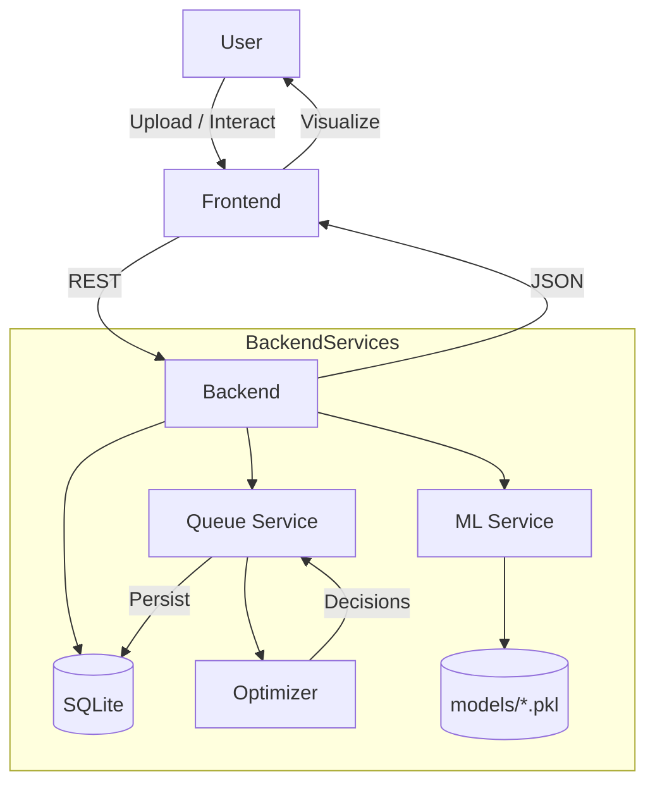

# SLAShield AI

AI-Powered Security Incident Queue Optimization & SLA Breach Prevention

---

## Table of Contents

- [Overview](#overview)
- [Problem Statement](#problem-statement)
- [Proposed Solution](#proposed-solution)
- [Key Features](#key-features)
- [System Architecture](#system-architecture)
- [System Workflow](#system-workflow)
- [AI / ML Architecture](#ai-ml-architecture)
- [ML Models](#ml-models)
- [Algorithms Used](#algorithms-used)
- [Feature Engineering](#feature-engineering)
- [Dataset](#dataset)
- [Data Pipeline](#data-pipeline)
- [Model Training](#model-training)
- [Model Evaluation](#model-evaluation)
- [How SLAShield Prevents SLA Breaches](#how-slashield-prevents-sla-breaches)
- [Queue Optimization Algorithm](#queue-optimization-algorithm)
- [Before AI vs After AI](#before-ai-vs-after-ai)
- [AI Decision Explanation](#ai-decision-explanation)
- [Dashboard](#dashboard)
- [API Documentation](#api-documentation)
- [Project Structure](#project-structure)
- [Technology Stack](#technology-stack)
- [Installation & Local Setup](#installation--local-setup)
- [Environment Variables](#environment-variables)
- [ML Model Deployment](#ml-model-deployment)
- [Deployment](#deployment)
- [Security Considerations](#security-considerations)
- [Limitations](#limitations)
- [Future Enhancements](#future-enhancements)
- [Performance & Scalability](#performance--scalability)
- [Hackathon Value Proposition](#hackathon-value-proposition)
- [Demo Workflow](#demo-workflow)
- [Development / Contributing](#development--contributing)

---

## Overview

SLAShield AI analyzes security incident queues, predicts per-ticket risk and operational signals, and recommends queue interventions (reassignment, prioritization, escalation) to reduce expected SLA breaches. The implementation in this repository couples a React (Vite) frontend to a Django REST backend that loads six pre-trained scikit-learn models (joblib .pkl files) and a deterministic optimizer implemented in `queue_optimizer.py`.

This README documents what is implemented in the repository (no invented features), how the ML models are used, how the queue optimizer works, and how to run the project locally.

## Problem Statement

Security Operations Centers (SOCs) receive many incident reports while analyst capacity is limited. Typical problems:

- Large incident queues and backlog
- Manual or FIFO prioritization that misses contextual risk
- Uneven analyst workload and capacity saturation
- SLA deadlines that can be missed when delays accumulate
- Difficulty identifying tickets most likely to breach SLAs before it is too late

Conventional FIFO or manual prioritization is often reactive and cannot systematically evaluate alternative interventions at scale.

## Proposed Solution

SLAShield AI ingests an incident queue (CSV/JSON or manual entry), validates and normalizes features, runs six ML models per ticket (severity, resolution time, queue delay, workload, SLA breach probability, escalation priority), and simulates candidate actions per ticket. The optimizer scores candidate interventions using model outputs + penalty weights and selects the action with the lowest score. Results are persisted and presented as a Before vs After optimized queue with metrics showing expected breaches avoided.

## Key Features (implemented)

- Incident ingestion via CSV/JSON upload and manual ticket creation.
- Data validation and normalization on upload (CSV/JSON parsing, duplicate ID checks).
- Six pre-trained ML models (classification/regression) loaded with `joblib`.
- Batch prediction pipeline and single-ticket prediction API.
- Queue optimization engine (`queue_optimizer.py`) that generates candidate actions and scores them using model outputs.
- Persistent storage of `Ticket`, `Analyst`, `QueueRun`, and `QueueDecision` records in the Django database (SQLite by default).
- Demo and synthetic model training scripts (`backend/demo_queue.py`, `backend/test_new_data.py`).
- React (Vite) frontend UI (components under `frontend/src/components/`) that calls the REST API.

## System Architecture



Only components present in the repository are shown above: React frontend, Django backend + REST API, ML models (joblib .pkl), queue optimizer, and SQLite DB (default).

## System Workflow

1. User uploads a CSV/JSON or creates a ticket via the frontend.
2. Backend `TicketUploadView` validates and normalizes the data (`backend/api/views.py`).
3. `MLService` prepares features and runs predictions (single or batch).
4. `queue_optimizer.py` computes baseline predictions and candidate action outcomes.
5. For each ticket a best action is selected using a scoring function (see [Queue Optimization Algorithm](#queue-optimization-algorithm)).
6. `QueueService` persists `QueueRun` and `QueueDecision` records and updates `Ticket` objects.
7. Frontend requests optimized results and displays Before vs After metrics and visualizations.

## AI / ML Architecture

The ML pipeline implemented in this repository follows these steps:

- Dataset generation / loading (synthetic scripts under `backend/`)
- Preprocessing and encoding (ColumnTransformer + OneHotEncoder used in training scripts)
- Model training (if models are missing, `demo_queue.py` will train synthetic models)
- Model serialization with `joblib` to `backend/models/*.pkl`
- Runtime model loading by `MLService` (singleton) and inference via `predict_ticket` in `queue_optimizer.py`.

### Feature set (used by all models)

The 14 base features used throughout are defined in `queue_optimizer.py` as `BASE_FEATURES`:

```
Incident_Type, Source, Attack_Vector, Priority,
Affected_Systems, Users_Affected, Threat_Score,
Analyst_Experience_Years, Current_Queue, Available_Analysts,
SLA_Hours, Historical_Incidents, Time_of_Day, Day_of_Week
```

## ML Models

The repository uses six pre-trained model artifacts (located at `backend/models/`):

- `severity_model.pkl` — Severity classification (Random Forest Classifier)
- `resolution_model.pkl` — Resolution time prediction (Random Forest Regressor)
- `queue_model.pkl` — Queue delay prediction (Random Forest Regressor)
- `workload_model.pkl` — Analyst workload prediction (Random Forest Regressor)
- `sla_model.pkl` — SLA breach probability (Random Forest Classifier using predict_proba)
- `escalation_model.pkl` — Escalation priority prediction (Random Forest Classifier)

Source of truth: `backend/api/services/ml_service.py` loads these files and `backend/demo_queue.py` contains the synthetic training pipeline that produces them when missing.

### Model details (training script)

- Training script: `backend/demo_queue.py`.
- Algorithm family: Random Forest (scikit-learn `RandomForestClassifier` / `RandomForestRegressor`).
- Preprocessing in training: `ColumnTransformer` + `OneHotEncoder(handle_unknown='ignore')` for categorical features; numerical features passed through.
- Hyperparameters used when training synthetic models (in `demo_queue.py`): `n_estimators=50`, `random_state=42` for all Random Forest learners.

## Algorithms Used

- Random Forest Classifier / Regressor (scikit-learn): used for classification and regression targets. Chosen in the demo/training scripts for robustness on mixed categorical/numeric data and interpretability for a hackathon prototype.
- One-Hot Encoding via `OneHotEncoder(handle_unknown='ignore')` and `ColumnTransformer`: used to encode categorical base features prior to modeling.

These are implemented in `backend/demo_queue.py` and expected at inference time by the saved pipelines.

## Feature Engineering

Raw features (input): the 14 `BASE_FEATURES` listed above.

Derived / predicted features (produced during inference):

- `Predicted_Resolution_Hours`
- `Predicted_Queue_Delay_Minutes`
- `Predicted_Analyst_Workload`
- `SLA_Breach_Probability` (percentage)
- `Escalation_Priority`

Why these matter: Priority, Threat_Score, and system/user counts correlate with severity and resolution time; analyst experience and available analysts affect workload and queue delay; SLA_Hours is used to determine breach probability relative to predicted resolution+delay.

## Dataset

- The repository contains scripts to generate synthetic cybersecurity-type tickets for development and testing (`backend/demo_queue.py`, `backend/test_new_data.py`).
- `demo_queue.py` trains synthetic models on a generated dataset of ~1,000 synthetic examples (see `train_and_save_synthetic_models()` in that file).
- `test_new_data.py` generates many scenario queues (100 total scenarios across categories) to validate optimizer integrity.

Important: the training data produced by these scripts is synthetic and intended for development and demonstration only. Not real SOC data.

## Data Pipeline

- Ingestion: `POST /api/tickets/upload/` accepts `multipart/form-data` with a `file` field containing CSV or JSON and optional `replace_queue` flag.
- Validation: `backend/api/views.py:TicketUploadView` parses CSV/JSON, checks for required fields (or assigns defaults), enforces no duplicate IDs, validates numeric ranges and priority values.
- Missing values: filled using defaults defined in `ml_service.prepare_feature_dict` and `queue_optimizer.validate_and_prepare_inputs`.
- Encoding: training uses `OneHotEncoder`; inference relies on serialized pipelines stored inside the `.pkl` model artifacts.

## Model Training

- Training routine (synthetic) is in `backend/demo_queue.py`.
- Preprocessing: categorical columns one-hot encoded; numerical columns passed through.
- Models trained: Random Forest classifiers/regressors with `n_estimators=50`, `random_state=42`.
- Trained models are serialized with `joblib.dump(...)` into `backend/models/*.pkl`.

## Model Evaluation

The repository does not store final evaluation metrics for production models. `demo_queue.py` and `test_new_data.py` produce outputs and console summaries; `test_new_data.py` writes CSVs summarizing scenario results. If you need persistent evaluation metrics (ROC-AUC, MAE, RMSE, etc.), add evaluation logging to the training script — not currently present in the repository.

## How SLAShield Prevents SLA Breaches

High-level mechanism:

1. Per-ticket predictions (resolution, queue delay, SLA breach probability) identify tickets at risk.
2. For each ticket, the optimizer generates candidate actions (KEEP_CURRENT, PRIORITIZE, REASSIGN, ESCALATE).
3. The optimizer simulates each candidate by adjusting input features (e.g., reducing Current_Queue, changing assigned analyst experience) and re-running prediction models in batch.
4. Each candidate is scored: the implementation uses a combined score where lower is better. The core scoring in `queue_optimizer.py` uses `score = (sla_breach_prob / 100.0) + penalty` where `penalty` encodes operation costs (reassignment, escalation, workload penalties).
5. The best-scoring action is selected and applied; the system calculates Before vs After expected breaches and persists the decision log.

The system therefore reduces expected SLA breach risk by simulating interventions and selecting cost-aware actions, not by guaranteeing compliance.

## Queue Optimization Algorithm

- Inputs: ticket DataFrame with `BASE_FEATURES`, analyst DataFrame with capacity and experience, and loaded model dict.
- Decision variables: action per ticket (KEEP_CURRENT, PRIORITIZE, REASSIGN, ESCALATE) and reassignment target analyst.
- Scoring: each candidate action yields an adjusted SLA breach probability (via `models['sla'].predict_proba(...)`), then a score is computed as `score = (sla_prob / 100.0) + penalty` (see `select_best_action_batch` in `queue_optimizer.py`).
- Penalty weights: default weights are defined in `queue_optimizer.py` as `DEFAULT_WEIGHTS = {"workload_penalty":0.35, "escalation_penalty":0.25, "reassignment_penalty":0.15}`. These are used to penalize analyst overload, escalation cost, and reassignment overhead.
- Output: an optimized ordered DataFrame (`new_position`) and per-ticket recommended_action, assigned_analyst_after, sla_breach_probability_after, and explanation.

## Before AI vs After AI

- The system compares expected breaches and average queue delay before and after applying recommended interventions.
- Breaches avoided = Expected_Breaches_Before − Expected_Breaches_After (this calculation appears in `test_new_data.py` and `queue_service.py`).

## AI Decision Explanation

Recommendations are deterministic outputs of the optimizer: for each ticket the selected action includes a short `reason` string assembled in `queue_optimizer.py` (for example: "Reassigned to Analyst A03 (Exp: 8y)." or "Bumped queue priority to mitigate SLA delay."). No external LLM is used.

## Dashboard

Frontend components live under `frontend/src/components/` (examples include `TicketIngestionView.jsx`, `UploadModal.jsx`, `QueueComparison.jsx`, `SLACountdownRadar.jsx`, `ModelTransparency.jsx`). The UI is a React (Vite) single-page app that calls the backend API.

## API Documentation

All implemented endpoints are defined in `backend/api/urls.py`. Key endpoints:

| Method              | Endpoint                    | Purpose                                                                                                                                                                                                            |
| ------------------- | --------------------------- | ------------------------------------------------------------------------------------------------------------------------------------------------------------------------------------------------------------------ |
| GET                 | `/api/health/`              | Returns system status and loaded model names.                                                                                                                                                                      |
| GET                 | `/api/dashboard/metrics/`   | Dashboard KPIs and metrics.                                                                                                                                                                                        |
| POST                | `/api/tickets/upload/`      | Upload CSV or JSON to ingest tickets. Accepts `multipart/form-data` with `file` and optional `replace_queue` (true/false). Returns JSON with `success`, `tickets_imported`, and `message` or error details on 400. |
| GET                 | `/api/tickets/`             | List active tickets (filterable).                                                                                                                                                                                  |
| POST                | `/api/tickets/`             | Create a single manual ticket (returns model predictions).                                                                                                                                                         |
| GET                 | `/api/tickets/<ticket_id>/` | Ticket details.                                                                                                                                                                                                    |
| PATCH               | `/api/tickets/<ticket_id>/` | Update fields (status, priority, assigned_analyst, sla_hours).                                                                                                                                                     |
| POST                | `/api/queue/optimize/`      | Run the optimizer and return Before/After queues and metrics.                                                                                                                                                      |
| GET                 | `/api/queue/before/`        | Baseline queue listing.                                                                                                                                                                                            |
| GET                 | `/api/queue/after/`         | Optimized queue listing.                                                                                                                                                                                           |
| GET                 | `/api/queue/history/`       | Past optimization runs and decisions.                                                                                                                                                                              |
| GET/POST/PUT/DELETE | `/api/analysts/`            | Analyst management.                                                                                                                                                                                                |
| GET/PUT             | `/api/sla-rules/`           | SLA rule configuration.                                                                                                                                                                                            |
| POST                | `/api/simulation/generate/` | Create scenario tickets for demo/testing.                                                                                                                                                                          |

Example: upload CSV (replace placeholders):

```bash
curl -v -X POST "https://your-backend.example/api/tickets/upload/" \
  -H "Origin: https://your-frontend.example" \
  -F "file=@/path/to/your/queue.csv" \
  -F "replace_queue=true"
```

Response (success):

```json
{
  "success": true,
  "filename": "queue.csv",
  "tickets_imported": 20,
  "message": "Successfully validated and ingested 20 incident tickets."
}
```

## Project Structure

Top-level layout (selected):

```
SLAShieldAI/
├─ backend/
│  ├─ api/ (Django app: models, views, serializers, services)
│  ├─ models/ (trained joblib .pkl model artifacts)
│  ├─ manage.py
│  ├─ requirements.txt
├─ frontend/
│  ├─ src/components/ (React components)
│  ├─ services/api.js
│  ├─ package.json
├─ docs/
│  ├─ implementation_plan.md
│  ├─ walkthrough.md
├─ README.md
```

## Technology Stack

- Frontend: React, Vite (see `frontend/package.json`).
- Backend: Django, Django REST Framework.
- ML / Data: scikit-learn (RandomForest used in training scripts), pandas, numpy, joblib.
- Database: SQLite (default in `backend/sla_shield/settings.py`).

## Installation & Local Setup

Prerequisites: Python 3.10+ (project venv contains site-packages for 3.14 in the repo but standard Python 3.10+ is recommended), Node.js + npm.

Backend (PowerShell example):

```powershell
cd backend
python -m venv venv
venv\Scripts\Activate.ps1
pip install -r requirements.txt
# Run DB migrations
python manage.py migrate
# (optional) seed default analysts
python manage.py shell -c "from api.services.queue_service import QueueService; QueueService.seed_default_analysts()"
python manage.py runserver
```

Frontend:

```powershell
cd frontend
npm install
# development
npm run dev
# or build for production
npm run build
```

Notes:

- The frontend expects `VITE_API_BASE_URL` at build/runtime if not using a reverse proxy. See `frontend/.env.example`.

## Environment Variables (observed in code)

- `DJANGO_SECRET_KEY` (backend)
- `DEBUG` (backend)
- `ALLOWED_HOSTS` (backend)
- `CORS_ALLOWED_ORIGINS` (backend) — comma-separated origins
- `CSRF_TRUSTED_ORIGINS` (backend)
- `SECURE_SSL_REDIRECT` (backend)
- `BACKEND_URL` / `VITE_API_BASE_URL` (frontend)

Refer to `backend/sla_shield/settings.py` and `frontend/.env.example` for examples.

## ML Model Deployment

- Trained model artifacts are `backend/models/{severity,resolution,queue,workload,sla,escalation}_model.pkl`.
- `MLService` (`backend/api/services/ml_service.py`) loads them at startup (cached singleton).
- If models are missing, `backend/demo_queue.py` contains code to train synthetic models and save them to `backend/models/`.

## Deployment

No production deployment manifests (Dockerfile / CI) are included in the repository. `frontend/.env.example` and `backend/.env` contain examples referencing Render hosts, but a full, automated deployment pipeline is not present in the repo. Configure environment variables on your host and deploy the Django app and static frontend assets according to your hosting provider.

## Security Considerations

- Input validation: `TicketUploadView` validates file type and dataset fields and returns 400 on validation failures.
- CORS: `django-cors-headers` is used; set `CORS_ALLOWED_ORIGINS` and `CSRF_TRUSTED_ORIGINS` in production.
- File uploads: size limits are set (`DATA_UPLOAD_MAX_MEMORY_SIZE`, `FILE_UPLOAD_MAX_MEMORY_SIZE` in `settings.py`) — increase these for larger files.
- Secrets: do not commit `DJANGO_SECRET_KEY` or other credentials to source control.

## Limitations

- Training data used in repository is synthetic and for demonstration only.
- No persisted model evaluation metrics are stored in the repo; add evaluation logging during training if required.
- Deployment manifests and production hardening are not included.
- The optimizer provides decision support and reduces expected breach risk; it does not guarantee prevention of all SLA breaches.

## Future Enhancements (suggested)

- Integrate with real ticketing systems (ServiceNow, Jira, etc.).
- Add model monitoring and drift detection.
- Add role-based access and audit logging.
- Add a production deployment pipeline (Docker + Kubernetes or managed services).

## Hackathon Value Proposition

SLAShield AI demonstrates a focused, measurable approach to reduce expected SLA breaches by combining predictive models and a simulation-based optimizer that evaluates intervention trade-offs in a SOC context. The prototype is runnable locally and includes scripts to reproduce synthetic training and validation runs.

## Demo Workflow (quick)

1. Start backend (`python manage.py runserver`).
2. Start frontend (`npm run dev`).
3. Upload a CSV via UI or call `POST /api/tickets/upload/`.
4. Run `POST /api/queue/optimize/` or trigger optimization from the UI.
5. Inspect Before vs After metrics and decision logs under `/api/queue/history/`.

---

### Files referenced during README generation

- `backend/api/services/ml_service.py`
- `backend/queue_optimizer.py`
- `backend/demo_queue.py`
- `backend/test_new_data.py`
- `backend/api/views.py`
- `backend/api/urls.py`
- `frontend/.env.example`

---

If you want, I can now:

1. Add an `API.md` with full example requests and sample JSON payloads.
2. Add a short `DEPLOYMENT.md` with Render / Docker Compose examples (you must confirm target platform).

Which should I add next?
