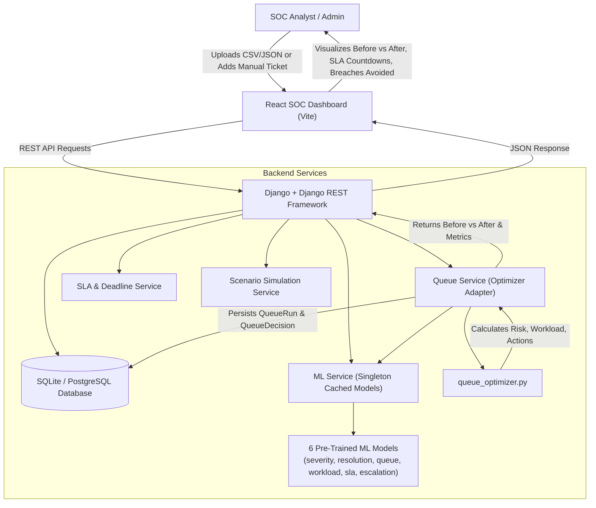

# SLA SHIELD AI — Implementation Plan
**AI-Powered Cybersecurity Incident Queue Optimization & SLA Breach Prevention System**

Build a full-stack, production-grade cybersecurity SOC operations application integrating Django REST Framework, the 6 existing pre-trained scikit-learn ML models, deterministic queue optimization engine, real-time SLA tracking, dynamic queue re-planning, and an ultra-modern React SOC dashboard.

---

## 1. Architectural Overview & Workflow

---

## 2. Backend Design (`backend/`)

### A. Django Project & App Setup
- Create Django project `sla_shield` and app `api` in `backend/`.
- Configure `settings.py` with:
  - Django REST Framework (serializers, validation, JSON parsers)
  - `django-cors-headers` (allowing React dev server communication)
  - Database settings (SQLite default with PostgreSQL support via env)
  - File upload limits & MIME validation
  - Static/Media configuration

### B. Database Models (`backend/api/models.py`)
1. **`Analyst`**:
   - `analyst_id` (CharField, unique primary key, e.g. `A01`, `A02`)
   - `name` (CharField)
   - `experience_years` (IntegerField)
   - `current_workload` (IntegerField)
   - `maximum_capacity` (IntegerField)
   - `active_tickets` (IntegerField, default=0)
   - `is_available` (BooleanField, default=True)
   - `skills` (JSONField, default=list)
2. **`SLARule`**:
   - `severity` (CharField, unique, e.g. `Critical`, `High`, `Medium`, `Low`)
   - `sla_hours` (FloatField, e.g. 2.0, 4.0, 8.0, 12.0)
   - `description` (CharField)
   - `updated_at` (DateTimeField, auto_now=True)
3. **`Ticket`**:
   - `ticket_id` (CharField, unique index)
   - *14 ML Feature Fields*: `incident_type`, `source`, `attack_vector`, `priority`, `affected_systems`, `users_affected`, `threat_score`, `analyst_experience_years`, `current_queue`, `available_analysts`, `sla_hours`, `historical_incidents`, `time_of_day`, `day_of_week`
   - *Assignment & Status*: `assigned_analyst` (CharField / FK), `status` (`OPEN`, `IN_PROGRESS`, `RESOLVED`, `CLOSED`, `ESCALATED`)
   - *SLA Timestamps*: `created_at` (DateTimeField), `deadline` (DateTimeField)
   - *ML Predictions & Optimizer Outputs*:
     - `predicted_severity` (CharField)
     - `predicted_resolution_hours` (FloatField)
     - `predicted_queue_delay` (FloatField)
     - `predicted_workload` (FloatField)
     - `sla_breach_probability_before` (FloatField)
     - `sla_breach_probability_after` (FloatField)
     - `recommended_action` (`KEEP_CURRENT`, `REASSIGN`, `ESCALATE`, `PRIORITIZE`)
     - `assigned_analyst_after` (CharField)
     - `escalation_priority` (`P1`, `P2`, `P3`, `P4`)
     - `reason` (TextField)
     - `original_position` (IntegerField)
     - `new_position` (IntegerField)
4. **`QueueRun`** (Optimization Run Records):
   - `timestamp` (DateTimeField, auto_now_add=True)
   - `total_tickets`, `expected_breaches_before`, `expected_breaches_after`, `breaches_avoided`, `breach_reduction_pct`
   - `average_queue_delay_before`, `average_queue_delay_after`, `delay_reduction_pct`
   - `reassignments_count`, `escalations_count`, `prioritizations_count`, `kept_count`
   - `high_risk_before`, `high_risk_after`
5. **`QueueDecision`** (Per-ticket decision log):
   - `queue_run` (ForeignKey to `QueueRun`)
   - `ticket_id`, `old_position`, `new_position`, `old_analyst`, `new_analyst`, `action`, `sla_risk_before`, `sla_risk_after`, `reason`

### C. ML & Optimization Services (`backend/api/services/`)
1. **`ml_service.py`**:
   - Singleton pattern: loads all 6 `.pkl` models (`severity_model.pkl`, `resolution_model.pkl`, `queue_model.pkl`, `workload_model.pkl`, `sla_model.pkl`, `escalation_model.pkl`) into memory once on startup.
   - Provides `predict_single(ticket_dict)` and `predict_batch(tickets_df)`.
   - Feature validation & normalization matching `BASE_FEATURES`.
2. **`queue_service.py`**:
   - Integrates `queue_optimizer.optimize_queue`.
   - Fetches active tickets and available analysts from DB.
   - Runs optimization, maps actions and explanations.
   - Atomic DB update of ticket positions, assignments, predictions, and creates `QueueRun` + `QueueDecision` log records.
3. **`sla_service.py`**:
   - Reads active `SLARule` settings to dynamically assign deadlines based on ticket creation timestamp and severity.
   - Calculates real-time remaining seconds and risk classifications.
4. **`simulation_service.py`**:
   - Implements standard scenarios matching `test_new_data.py`: `NORMAL`, `CRITICAL_SURGE`, `ANALYST_OVERLOAD`, `SLA_CRISIS`, `HEAVY_LOAD`.
   - Generates synthetic ticket batches and workload spikes for live hackathon demonstration.

### D. REST API Endpoints (`backend/api/urls.py` & `views.py`)
- `GET /api/health/` — Engine online status, model load verification
- `GET /api/dashboard/metrics/` — High-density KPIs, breaches avoided, capacity, breach trend
- `POST /api/tickets/upload/` — CSV/JSON upload with validation & preview
- `GET /api/tickets/` — Ticket listing with search/filtering
- `POST /api/tickets/` — Manual ticket creation with real-time ML prediction
- `GET /api/tickets/<id>/` — Single ticket details
- `PATCH /api/tickets/<id>/` — Update status, priority, SLA hours, or delete/close ticket
- `POST /api/queue/optimize/` — Run AI optimization and generate before vs after queues
- `GET /api/queue/before/` & `GET /api/queue/after/` — Compare baseline vs optimized queues
- `GET /api/queue/history/` — Historical optimization runs and decision logs
- `GET /api/analysts/`, `POST /api/analysts/`, `PUT /api/analysts/<id>/`, `DELETE /api/analysts/<id>/` — Analyst fleet management
- `GET /api/sla-rules/`, `PUT /api/sla-rules/` — SLA hours configuration
- `POST /api/simulation/generate/` — Generate scenario queues (20-50 tickets)

---

## 3. Frontend Architecture (`frontend/`)

Create a fast, responsive React application using Vite:
- **Design Aesthetic**: Premium SOC (Security Operations Center) cyber-command center theme:
  - Deep dark theme (`#0a0e17`, `#111927`, `#1e293b`), neon cyan/emerald/amber/crimson accents
  - Glassmorphic panels, subtle glow borders, high information density
  - Zero mock data — 100% connected to live Django REST APIs

### Pages & Sub-Views:
1. **SOC Dashboard (`/dashboard`)**:
   - **Header**: Live AI Engine status indicator, Last Optimization timestamp, primary **"RUN AI OPTIMIZATION"** CTA button.
   - **KPI Metric Cards**:
     - *Active Tickets* (Total, Critical, High, Medium, Low breakdown)
     - *High Risk Tickets* (SLA Breach Probability >= 50%)
     - *Expected SLA Breaches* (Before vs After with delta)
     - *Breaches Avoided by AI* (Highlighted Hero Card with Avoidance % + Reassignment/Escalation/Prioritization breakdown)
     - *Average Queue Delay* (Before vs After in minutes)
     - *Analyst Fleet Utilization* (Total capacity vs current workload)
   - **SLA Countdown Radar**: Live ticking countdown timer for every active ticket with dynamic color status (Green Safe, Yellow Approaching, Orange High Risk, Red Breach Imminent).
   - **Analyst Workload & Capacity Fleet**: Real-time progress bars for each analyst (e.g. `A01: 8/10 80% BUSY`, `A05: 2/8 25% AVAILABLE`) with direct capacity adjusters.
   - **Escalation Priority Queue**: P1/P2 critical escalation tickets sorted by urgency with senior analyst recommendations and rationale.
   - **Before vs After AI Queue Comparison**:
     - Position changes (`#1 INC00017` -> `#15 INC00017`), Action badges (`REASSIGN`, `ESCALATE`, `PRIORITIZE`, `KEEP_CURRENT`), Movement arrows (`↑`, `↔`, `🔄`, `🚨`), SLA risk deltas (`70% → 22%`).
   - **SLA Breach Trend & Avoidance Chart**: Interactive SVG visualizer showing breach probabilities before vs after across runs.
   - **AI Decision Rationale Feed**: Explaining why each ticket was reassigned/escalated/prioritized based on actual model outputs.
2. **Ticket Ingestion & Management (`/tickets`)**:
   - CSV / JSON Drag & Drop file uploader with validation summary, preview modal, error handling.
   - Manual Ticket Creator with live ML prediction breakdown before adding to the queue.
   - Searchable, filterable ticket table with actions to close/edit/reassign.
3. **Queue Optimization Command Center (`/queue`)**:
   - Full side-by-side comparison table, filterable by AI action.
   - Instant "Re-Optimize Queue" trigger.
4. **Analyst Management (`/analysts`)**:
   - Analyst roster management, experience, max capacity, workload sliders.
5. **SLA Configuration (`/sla-settings`)**:
   - Configurable SLA thresholds by severity (Critical, High, Medium, Low) with live backend persistence.
6. **Scenario Simulation & Stress Lab (`/simulation`)**:
   - One-click demo scenarios: "Normal Operations", "Critical Surge", "Analyst Overload", "SLA Crisis", "Heavy Load".
   - Workload spike injector and real-time re-planning demonstration.
7. **ML Model Performance & Transparency (`/model-info`)**:
   - Technical transparency section explaining the 6 models, features used, and prototype notice.

---

## 4. Verification & Testing Plan

### Automated Backend Tests:
- Run `python manage.py test api` testing:
  - Model loading & singleton persistence
  - ML inference pipeline across 6 models
  - Ticket input validation (missing features, bad types, duplicate IDs)
  - CSV and JSON upload parsers
  - `optimize_queue` integration (zero ticket drops, zero duplicates)
  - Real-time SLA calculation and deadline assignment
  - Analyst capacity constraints and workload tracking
  - Before vs after metrics calculation
- Run `backend/demo_queue.py` and verify exact matching output.
- Run `backend/test_new_data.py` to confirm 100 scenario queues pass integrity checks.

### End-to-End Manual / Browser Verification:
1. Start Django backend server on `http://127.0.0.1:8000`.
2. Start Vite React frontend on `http://localhost:5173`.
3. Test Health API & initial database seeding (5 analysts, 4 SLA rules, 20 initial tickets).
4. Verify Dashboard displays live active tickets, SLA countdowns, analyst workloads, and escalation queue.
5. Click **"RUN AI OPTIMIZATION"** — verify Before vs After queue renders with movement badges, risk reduction, and breaches avoided KPI.
6. Test **"Add Ticket Manually"** with ML prediction preview -> Add to queue -> Re-optimize -> Verify queue dynamic re-plan.
7. Test **"Upload CSV / JSON"** with valid and invalid files -> Verify validation error alerts and successful ingestion.
8. Test **"Simulate Incoming Tickets"** / **"Load Demo Scenario"** (e.g. Critical Surge) -> Verify dynamic re-optimization.
9. Test modifying Analyst workload and SLA rules -> Re-optimize -> Confirm new capacities and thresholds affect queue sorting.

---

*Once approved, implementation will proceed systematically: Backend setup -> Database models & Migrations -> Service Layer & ML integration -> REST API Endpoints -> Seeding & Unit Tests -> React Frontend App & Components -> Full End-to-End Verification.*
